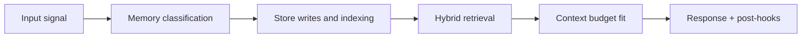

# Tony Memory System Architecture (Canonical)

This is the canonical architecture specification for Tony memory.  
It defines how memory is modeled, written, retrieved, scored, governed, and operated at scale.

## 1. Design Intent

Tony is built around seven memory systems because each one prevents a specific failure mode:

1. loss of in-flight reasoning state
2. loss of active conversation continuity
3. loss of historical events over time
4. loss of stable facts/preferences/decisions
5. loss of entity relationships and dependencies
6. loss of personalized behavioral consistency
7. loss of future commitments and follow-through

## 2. Canonical Diagrams

| Diagram | Contract role |
|---|---|
| `memory_taxonomy.svg` | Type system contract (what memory exists) |
| `memory_lifecycle.svg` | Lifecycle contract (how memory moves) |
| `graphify_dual_retrieval.svg` | Retrieval contract (how memory is recovered) |

All architecture docs must remain semantically aligned with these three diagrams.

## 3. Memory Type Topology

| Type | Question answered | Primary backend(s) | Write mode | Read mode |
|---|---|---|---|---|
| Working | "What is happening right now?" | LLM context | ephemeral only | direct in-call |
| Session | "What is happening in this conversation?" | Redis + PostgreSQL | real-time append | hot tail + warm summary |
| Episodic | "What happened and when?" | Qdrant + ClickHouse + MinIO | consolidation lanes | semantic + temporal |
| Semantic | "What is true / preferred / decided?" | Qdrant + PostgreSQL index | realtime + consolidation | vector retrieval |
| Relational | "How are entities connected?" | Neo4j | Graphify post-write | graph traversal |
| Procedural | "How should Tony behave for this user?" | PostgreSQL + Redis + ClickHouse + disk prompts | config + analytics loop | pre-response policy load |
| Prospective | "What must Tony do later?" | PostgreSQL + Redis queue + n8n + Qdrant context | extraction + scheduling | due-trigger + context recall |

## 4. Storage Architecture and Tiers

### Tier 0: Live

- In-request memory in model context.
- Contains prompt state, tool results, and temporary execution-plan state.
- Destroyed after final synthesis.

### Tier 1: Hot

- Redis keeps last 20 messages in `session:{id}:messages`.
- Context fetch is sub-millisecond.
- TTL keeps this tier lean (commonly ~2h).

### Tier 2: Warm

- PostgreSQL stores full transcript rows and session summaries.
- Used for older in-session turns and short/medium horizon search.
- Supports FTS and indexed retrieval by user/session/topic/date.

### Tier 3: Cold durable

- Qdrant stores semantic vectors and payload metadata.
- Neo4j stores entity graph and relationship evidence.
- MinIO keeps immutable raw transcript archive.
- ClickHouse stores event/timeline analytics for episodic/procedural insights.

## 5. Write Paths

### Real-time path

Used when an interaction is explicitly memory-worthy in current turn.

1. classify memory candidate
2. assign `content_type` and preliminary importance
3. embed and write to Qdrant
4. persist index/audit row in PostgreSQL
5. trigger Graphify for relational extraction

### Consolidation path (async)

Triggered on session idle/close and by nightly deep passes.

1. load transcript
2. summarize and extract candidates
3. score and threshold
4. write accepted memories to vector store and index
5. feed accepted memories to Graphify
6. archive full session payload to MinIO

## 6. Graphify Contract (Architecture View)

Graphify converts accepted memory chunks into graph structure:

- Extracts typed nodes and directed edges.
- Emits relationship confidence scores.
- Writes to Neo4j via `MERGE`, not `CREATE`.

`MERGE` is intentionally used for idempotent updates.  
For performance and consistency, graph schema must include supporting indexes/constraints for merge keys.

## 7. Retrieval Architecture

Every request runs a dual-path retrieval:

1. **Vector path (Qdrant)**
   - embed query
   - nearest-neighbor search (top-k, commonly 12)
   - rerank by combined score
2. **Graph path (Neo4j)**
   - entity extraction from query
   - node match
   - 1-2 hop traversal for structurally relevant context
3. **Merge path**
   - deduplicate overlap
   - unified ranking
   - token-budget fitting
   - inject into ContextBundle

Parallel execution of both paths is required so memory retrieval remains low-latency.

## 8. Scoring and Decay

Canonical ranking formula:

```text
retrieval_score =
  (0.5 * semantic_similarity) +
  (0.2 * exp(-0.05 * days_since_creation)) +
  (0.2 * importance_score) +
  (0.1 * normalized_access_count)
```

Implications:

- semantic relevance remains dominant
- old but important/frequently accessed memory can still win
- recency decays continuously, not as a hard cutoff

## 9. Safety, Policy, and Governance

Memory architecture enforces:

- user-level data partitioning and access controls
- privacy-level tagging (`private`, `sensitive`, etc.)
- explicit forget/redaction workflows across all stores
- auditability for writes, updates, and deletions

No silent write failure is allowed; failures are retried or surfaced with explicit terminal reason.

## 10. Operational Architecture

Memory is operated as asynchronous jobs with clear SLOs:

- fast-lane consolidation availability
- deep-lane throughput
- retrieval latency and hit quality
- forget completion reliability

Operational and incident details are defined in `operations/`.

## 11. Extended Spec Map

- Type-level behavior: `types/README.md`
- Runtime and control flow: `architecture/runtime.md`
- Storage/lifecycle details: `architecture/storage-and-lifecycle.md`
- Retrieval/graph internals: `architecture/retrieval-and-graph.md`
- Data/interface contracts: `contracts/`
- Runbooks and SRE guidance: `operations/`
- End-to-end behavior flows: `workflow/`
- Stage-by-stage implementation pipelines: `pipeline/`

<!-- memory-expansion-2026-04-10 -->

## Builder Addendum: Expanded Control Surface

This addendum extends the document with practical implementation controls for the Tony memory runtime.

| Control surface | Default posture | Why it matters |
|---|---|---|
| Candidate precision | threshold-gated writes | reduces low-signal memory pollution |
| Recall diversity | vector + graph blending | improves answer richness and grounding |
| Durability | multi-store receipts + audit trail | prevents silent memory loss |
| Cost efficiency | token-budget fitting and pruning | preserves quality under context limits |


