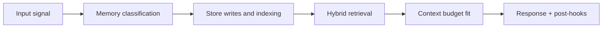

# Memory Architecture Docs

## Index

1. [Documents](#documents)
2. [Canonical alignment](#canonical-alignment)
3. [Builder Addendum: Expanded Control Surface](#builder-addendum-expanded-control-surface)

## Documents

| File | Scope |
|---|---|
| `runtime.md` | Core runtime components, control loops, and async lanes |
| `storage-and-lifecycle.md` | Tiered storage, retention windows, and data movement |
| `retrieval-and-graph.md` | Dual-path retrieval, Graphify extraction, and merge logic |

## Canonical alignment

These docs must stay aligned with:

- `../memory_taxonomy.svg`
- `../memory_lifecycle.svg`
- `../graphify_dual_retrieval.svg`
- `../architecture.md`

<!-- memory-expansion-2026-04-10 -->

## Builder Addendum: Expanded Control Surface

This addendum extends the document with practical implementation controls for the Tony memory runtime.

| Control surface | Default posture | Why it matters |
|---|---|---|
| Candidate precision | threshold-gated writes | reduces low-signal memory pollution |
| Recall diversity | vector + graph blending | improves answer richness and grounding |
| Durability | multi-store receipts + audit trail | prevents silent memory loss |
| Cost efficiency | token-budget fitting and pruning | preserves quality under context limits |

