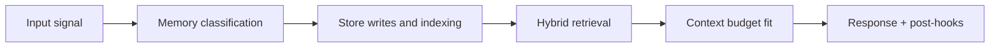

# Retrieval and Graph Architecture

## 1. Retrieval objective

Produce the highest-value memory context for each request under strict latency and token constraints.

## 2. Dual-path retrieval contract

### Vector path (Qdrant)

1. build enriched query text (`message + entities + intent topic`)
2. embed query vector
3. run nearest-neighbor search (top-k, usually 12)
4. apply payload filters (`user_id`, privacy, type)
5. rerank candidates with scoring formula

### Graph path (Neo4j)

1. extract named entities from query
2. match canonical graph nodes
3. traverse 1-2 hops using allowed relationship types
4. return related nodes, edges, and edge metadata

### Merge path

1. union vector and graph results
2. deduplicate by canonical memory ID
3. compute final ordering
4. trim to token budget
5. emit memory layer for ContextBundle

## 3. Canonical scoring

```text
retrieval_score =
  (0.5 * semantic_similarity) +
  (0.2 * exp(-0.05 * days_since_creation)) +
  (0.2 * importance_score) +
  (0.1 * normalized_access_count)
```

Recommended interpretation:

- 0.5: semantic relevance remains dominant
- 0.2: recency keeps context current without hard cutoff
- 0.2: persistent value of high-importance memories
- 0.1: reinforcement from repeated successful retrieval

## 4. Graphify extraction architecture

Graphify runs after accepted memory writes and emits structured graph payloads:

- node label + canonical name
- relationship type + direction
- confidence score (0-1)
- source memory reference

Neo4j write strategy:

- `MERGE` nodes and relationships for idempotency
- update `last_confirmed_at` and confidence reinforcement fields
- maintain deterministic merge keys to avoid accidental duplicates

## 5. Graph schema posture

Typical node labels:

`Person`, `Project`, `Concept`, `Decision`, `Task`, `Event`, `Goal`, `Note`, `Tool`, `Technology`, `Organisation`, `Place`

Typical relationship types:

`WORKS_ON`, `DEPENDS_ON`, `BLOCKS`, `ABOUT`, `RELATED_TO`, `HAS_ROLE`, `PART_OF`, `SUPPORTS`, `CONTRADICTS`, `PRECEDES`, `USES`

## 6. Performance envelope

Retrieval path should run as parallel stages:

- vector and graph in parallel
- final merge once both complete

Latency budget is controlled by:

- fixed top-k bounds
- bounded hop depth (1-2)
- precomputed indexes and constraints
- token-budget trimming before prompt injection

## 7. Failure handling

If one path fails:

- return partial results from surviving path with degraded-mode marker
- log stage-specific failure reason
- avoid silent success-shape fallbacks

If both fail:

- return explicit retrieval failure and fallback to session-only context
- emit high-severity operational signal

## 8. Quality controls

- track overlap ratio between vector and graph results
- measure contribution lift from each path
- monitor retrieval miss rate and hallucination-linked misses
- evaluate recall quality on representative benchmark queries

<!-- memory-expansion-2026-04-10 -->

## Builder Addendum: Expanded Control Surface

This addendum extends the document with practical implementation controls for the Tony memory runtime.

| Control surface | Default posture | Why it matters |
|---|---|---|
| Candidate precision | threshold-gated writes | reduces low-signal memory pollution |
| Recall diversity | vector + graph blending | improves answer richness and grounding |
| Durability | multi-store receipts + audit trail | prevents silent memory loss |
| Cost efficiency | token-budget fitting and pruning | preserves quality under context limits |


