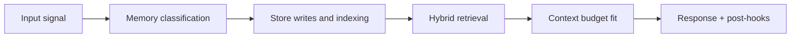

# Memory Runtime Architecture

## 1. Runtime objectives

1. keep active conversation continuity without latency spikes
2. make durable memory available quickly after session idle/close
3. recover the most relevant context under strict token budgets
4. preserve correctness and auditability across async operations

## 2. Core runtime components

| Component | Responsibility |
|---|---|
| `SessionWriteHook` | appends turn data to hot and warm stores |
| `ContextAssembler` | builds context from session + retrieved memory |
| `MemoryAgent` | extraction, scoring, consolidation, writes |
| `HybridMemoryRetriever` | vector + graph retrieval merge |
| `Graphify` | entity/relationship extraction and Neo4j update |
| `ProspectiveScheduler` | due reminders and proactive follow-ups |
| `PolicyLayer` | privacy, access, and forget constraints |

## 3. Runtime control loops

### Loop A: request-response loop (synchronous)

1. ingest user message with `session_id`
2. write to session buffers
3. retrieve memory context (dual-path)
4. assemble context bundle
5. run agent/tool loop
6. synthesize and send response

### Loop B: fast consolidation loop (asynchronous)

Trigger: session idle (about 10m) or explicit close.

1. load transcript and summary candidates
2. extract memory items
3. score and threshold
4. write accepted memories
5. dispatch Graphify
6. emit metrics and traces

### Loop C: deep consolidation loop (scheduled)

Trigger: nightly, usually for sessions older than 7 days.

1. select eligible sessions
2. stable chunking
3. embed and write chunk memories
4. archive raw transcript
5. mark archive version

### Loop D: prospective execution loop

Trigger: schedule (cron/calendar/webhook).

1. scan due reminders/commitments
2. apply trigger policy and dedupe
3. execute follow-up workflow
4. persist outcome and next state

## 4. Lane model

| Lane | Trigger | Max stale window intent | Output |
|---|---|---|---|
| Real-time lane | explicit memorable statement | immediate | direct memory write |
| Fast lane | idle/close | low | summary + high-value memories |
| Deep lane | nightly | medium/high | durable chunk embeddings + archive |
| Prospective lane | schedule/event | due-time bounded | reminders/follow-ups |

## 5. Runtime state machine (memory item)

```text
detected -> extracted -> scored -> accepted/rejected
accepted -> embedded -> indexed -> graphified -> retrievable
accepted -> scheduled (if prospective) -> due -> completed/expired
```

Terminal failure states must include explicit reason and retry policy classification.

## 6. Runtime interfaces

### Input contract (retrieval)

- query text
- extracted entities
- intent topic
- user/session identity
- memory policy context (privacy level, filters)

### Output contract (retrieval)

- ranked memory candidates
- scoring breakdown per candidate
- source path (`vector`, `graph`, `both`)
- token estimate metadata

## 7. Guardrails

- hard cap on retrieved candidate count before merge
- token budget fit before prompt injection
- privacy-level filter before ranking
- no silent failure on write/extract/retrieval

## 8. Concurrency and idempotency

- retrieval paths execute in parallel
- consolidation jobs are idempotent by session + version keys
- graph updates use deterministic merge keys and timestamps
- reminder triggers use dedupe keys to avoid duplicate follow-ups

## 9. Runtime observability hooks

Per request/job, emit:

- latency by stage
- candidate counts before/after filters
- acceptance/rejection counts
- retry attempts and terminal reasons
- final context token allocation by layer

<!-- memory-expansion-2026-04-10 -->

## Builder Addendum: Expanded Control Surface

This addendum extends the document with practical implementation controls for the Tony memory runtime.

| Control surface | Default posture | Why it matters |
|---|---|---|
| Candidate precision | threshold-gated writes | reduces low-signal memory pollution |
| Recall diversity | vector + graph blending | improves answer richness and grounding |
| Durability | multi-store receipts + audit trail | prevents silent memory loss |
| Cost efficiency | token-budget fitting and pruning | preserves quality under context limits |


