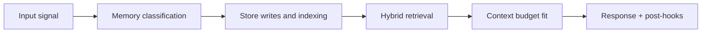

# Storage and Lifecycle Architecture

## 1. Storage role map

| Backend | Primary memory roles | Notes |
|---|---|---|
| Redis | hot session tail, short-lived queues, cache | sub-millisecond path |
| PostgreSQL | warm transcript, summaries, canonical indexes, reminders | source of record for structured rows |
| Qdrant | semantic/episodic vectors and payload metadata | nearest-neighbor + hybrid query support |
| Neo4j | relational graph and edge confidence history | graph traversal for structural context |
| ClickHouse | event logs, temporal behavior analytics | high-throughput observability/analytics |
| MinIO S3 | immutable raw archives | cold durability and replay |

## 2. Lifecycle tiers

### Tier 0: live

- request-local, in-model only
- no persistence

### Tier 1: hot

- Redis tail of active conversation
- TTL-driven freshness

### Tier 2: warm

- PostgreSQL transcript and summary tables
- optimized for medium-horizon continuity and search

### Tier 3: cold durable

- vector, graph, event analytics, and raw archive
- optimized for long-horizon recall and reconstruction

## 3. Data movement events

| Event | Transition |
|---|---|
| New turn | Tier 0 -> Tier 1 (+ warm append policy) |
| Tail overflow (>20 turns) | Tier 1 -> Tier 2 |
| Idle/close | Tier 2 -> Tier 3 candidate extraction |
| Nightly deep pass | Tier 2 -> Tier 3 dense chunking/archive |
| Forget request | Tier 2/3 redaction/deletion workflow |

## 4. Retention model

| Class | Default posture | Operational pattern |
|---|---|---|
| Hot session tail | short TTL | auto-expire |
| Warm transcripts | medium to long | partition and prune by policy |
| Vector memories | long-term | explicit forget or policy purge |
| Graph edges/nodes | long-term | confidence aging + redaction on forget |
| Raw archives | long-term immutable | lifecycle policy + legal controls |

## 5. PostgreSQL retention strategy

Use declarative partitioning for large transcript/reminder/event tables:

- partition by time (range partitioning)
- prune by dropping/detaching old partitions
- keep active partitions indexed for hot/warm queries

This avoids heavy bulk delete/VACUUM cycles and improves retention maintenance.

## 6. Consistency model

Memory architecture is eventually consistent across stores:

- PostgreSQL index rows are authoritative for canonical lifecycle state
- vector/graph writes are asynchronous but trace-correlated
- replay/repair jobs reconcile partial failures

## 7. Deletion and redaction lifecycle

Forget and redaction operations must propagate to all relevant stores:

1. validate target identity and scope
2. soft-delete/mark in canonical index
3. delete vector points
4. detach/remove graph edges/nodes or redact properties
5. mark archive tombstone/redaction manifest
6. emit deletion audit event

## 8. Capacity planning checkpoints

- Redis memory headroom by active session count
- PostgreSQL partition growth and index bloat
- Qdrant collection size and query latency
- Neo4j node/edge growth and traversal cost
- MinIO object growth and retrieval cost
- ClickHouse ingestion/query cost envelope

<!-- memory-expansion-2026-04-10 -->

## Builder Addendum: Expanded Control Surface

This addendum extends the document with practical implementation controls for the Tony memory runtime.

| Control surface | Default posture | Why it matters |
|---|---|---|
| Candidate precision | threshold-gated writes | reduces low-signal memory pollution |
| Recall diversity | vector + graph blending | improves answer richness and grounding |
| Durability | multi-store receipts + audit trail | prevents silent memory loss |
| Cost efficiency | token-budget fitting and pruning | preserves quality under context limits |

