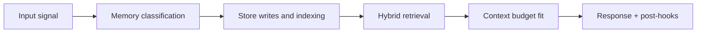

# Graphify Contract

## 1. Purpose

Define the extraction payload and write semantics used to convert memory chunks into Neo4j graph structure.

## 2. Extraction input

```json
{
  "memory_id": "mem_uuid",
  "user_id": "usr_uuid",
  "content": "Rajan leads backend for Project Atlas using PostgreSQL",
  "content_type": "fact",
  "created_at": "2026-04-10T19:30:00Z"
}
```

## 3. Extraction output

```json
{
  "nodes": [
    { "label": "Person", "name": "Rajan", "confidence": 0.98 },
    { "label": "Project", "name": "Atlas", "confidence": 0.97 },
    { "label": "Technology", "name": "PostgreSQL", "confidence": 0.99 }
  ],
  "relationships": [
    {
      "from": { "label": "Person", "name": "Rajan" },
      "type": "WORKS_ON",
      "to": { "label": "Project", "name": "Atlas" },
      "confidence": 0.95
    },
    {
      "from": { "label": "Project", "name": "Atlas" },
      "type": "USES",
      "to": { "label": "Technology", "name": "PostgreSQL" },
      "confidence": 0.93
    }
  ]
}
```

## 4. Node and edge constraints

- `label` must be from approved node label set
- relationship `type` must be from approved relationship type set
- names are canonicalized before merge (trim/case normalization rules)
- confidence is required and bounded to `[0, 1]`

## 5. Write semantics

Neo4j writes must use:

1. `MERGE` node by canonical key (`user_id`, `label`, `canonical_name`)
2. `MERGE` relationship by (`from_key`, `type`, `to_key`)
3. `ON CREATE` set `created_at`, `source_memory_id`, initial confidence
4. `ON MATCH` update `last_confirmed_at`, adjust confidence/weight

## 6. Uniqueness and performance requirements

- property uniqueness constraints for merge keys
- indexes on frequently merged node properties
- bounded transaction batch sizes for high-volume jobs

## 7. Conflict handling

- if extractor emits conflicting edge direction/type, store contradiction metadata
- do not silently overwrite prior contradictory edge without evidence tracking
- preserve source references for explainability

## 8. Failure contract

- extraction failure: memory remains retrievable via vector path
- graph write failure: retry with exponential backoff
- terminal failure: emit explicit job failure with memory and reason IDs

<!-- memory-expansion-2026-04-10 -->

## Builder Addendum: Expanded Control Surface

This addendum extends the document with practical implementation controls for the Tony memory runtime.

| Control surface | Default posture | Why it matters |
|---|---|---|
| Candidate precision | threshold-gated writes | reduces low-signal memory pollution |
| Recall diversity | vector + graph blending | improves answer richness and grounding |
| Durability | multi-store receipts + audit trail | prevents silent memory loss |
| Cost efficiency | token-budget fitting and pruning | preserves quality under context limits |


