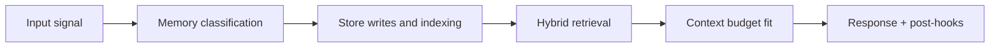

# Retrieval Contract

## 1. Interface

### Input

```json
{
  "user_id": "usr_uuid",
  "session_id": "sess_uuid",
  "query_text": "what did we decide about the database for atlas",
  "entities": ["Project Atlas", "database"],
  "intent_topic": "decision_recall",
  "token_budget": 1800,
  "privacy_scope": ["private", "sensitive"],
  "top_k_vector": 12,
  "max_graph_hops": 2
}
```

### Output

```json
{
  "retrieval_id": "ret_uuid",
  "status": "ok",
  "vector_candidates": 12,
  "graph_candidates": 9,
  "merged_candidates": 15,
  "selected_candidates": 8,
  "token_estimate": 1460,
  "items": [
    {
      "memory_id": "mem_uuid",
      "source_path": "both",
      "retrieval_score": 0.84,
      "score_breakdown": {
        "semantic_similarity": 0.91,
        "recency": 0.62,
        "importance": 0.88,
        "access": 0.33
      }
    }
  ]
}
```

## 2. Scoring contract

```text
retrieval_score =
  (0.5 * semantic_similarity) +
  (0.2 * exp(-0.05 * days_since_creation)) +
  (0.2 * importance_score) +
  (0.1 * normalized_access_count)
```

All score components must be normalized to `[0, 1]`.

## 3. Dual-path execution contract

1. vector and graph retrieval execute in parallel
2. both paths enforce `user_id` and `privacy_scope` filtering
3. graph traversal depth is bounded by `max_graph_hops`
4. merge deduplicates by canonical `memory_id`

## 4. Token budget contract

- input `token_budget` is hard upper bound
- item selection is descending by final score
- if over budget, lowest-ranked items are dropped first
- output includes token estimate and selected count

## 5. Degraded-mode behavior

| Failure case | Required behavior |
|---|---|
| vector path failure | return graph-only results with degradation marker |
| graph path failure | return vector-only results with degradation marker |
| both fail | return explicit retrieval error status |

## 6. Telemetry contract

Emit at minimum:

- path latencies (`vector_ms`, `graph_ms`, `merge_ms`)
- candidate counts (before/after filter and merge)
- token budget utilization ratio
- degraded-mode flags and reasons

<!-- memory-expansion-2026-04-10 -->

## Builder Addendum: Expanded Control Surface

This addendum extends the document with practical implementation controls for the Tony memory runtime.

| Control surface | Default posture | Why it matters |
|---|---|---|
| Candidate precision | threshold-gated writes | reduces low-signal memory pollution |
| Recall diversity | vector + graph blending | improves answer richness and grounding |
| Durability | multi-store receipts + audit trail | prevents silent memory loss |
| Cost efficiency | token-budget fitting and pruning | preserves quality under context limits |


