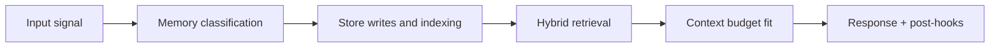

# Memory Architecture (Compatibility Entry)

This file is kept for backward compatibility with older links.

The canonical architecture spec now lives at:

- `architecture.md`

Use that file as the source of truth for:

- seven-memory-type topology
- hot/warm/cold lifecycle
- Graphify and Neo4j merge semantics
- dual-path retrieval and token-budget merge
- scoring, governance, and operations model

<!-- memory-expansion-2026-04-10 -->

## Builder Addendum: Expanded Control Surface

This addendum extends the document with practical implementation controls for the Tony memory runtime.

| Control surface | Default posture | Why it matters |
|---|---|---|
| Candidate precision | threshold-gated writes | reduces low-signal memory pollution |
| Recall diversity | vector + graph blending | improves answer richness and grounding |
| Durability | multi-store receipts + audit trail | prevents silent memory loss |
| Cost efficiency | token-budget fitting and pruning | preserves quality under context limits |

