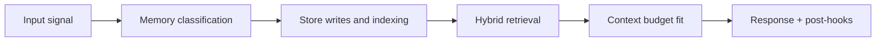

# Memory Operations

## Index

1. [Documents](#documents)
2. [Operations posture](#operations-posture)
3. [Builder Addendum: Expanded Control Surface](#builder-addendum-expanded-control-surface)

## Documents

| File | Scope |
|---|---|
| `consolidation-and-retention.md` | fast/deep lane operations, retention and purge controls |
| `slos-alerting-and-capacity.md` | SLI/SLO definitions, alerts, and capacity planning |
| `incidents-and-recovery.md` | incident playbooks and recovery procedures |
| `reembed-and-backfill.md` | vector model migration, re-embed, and backfill workflows |

## Operations posture

1. no silent failure in critical memory pipelines
2. replayable jobs with explicit terminal reasons
3. measurable retrieval quality and latency
4. auditable delete/redaction completion across all stores

<!-- memory-expansion-2026-04-10 -->

## Builder Addendum: Expanded Control Surface

This addendum extends the document with practical implementation controls for the Tony memory runtime.

| Control surface | Default posture | Why it matters |
|---|---|---|
| Candidate precision | threshold-gated writes | reduces low-signal memory pollution |
| Recall diversity | vector + graph blending | improves answer richness and grounding |
| Durability | multi-store receipts + audit trail | prevents silent memory loss |
| Cost efficiency | token-budget fitting and pruning | preserves quality under context limits |

