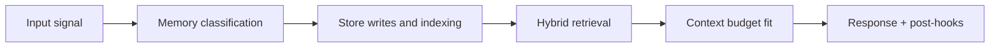

# Consolidation and Retention Operations

## 1. Job catalog

| Job | Trigger | Purpose |
|---|---|---|
| Fast consolidation | session idle/close | summary + high-value memory extraction |
| Deep consolidation | nightly scheduler | full transcript chunking and archival |
| Graphify replay | scheduled/manual | rebuild or repair graph edges |
| Re-embed | manual/scheduled | migrate vectors to new embedding model |
| Forget propagation | user/system request | remove/redact across all stores |

## 2. Fast consolidation runbook

1. load full warm transcript by `session_id`
2. generate/update session summary
3. extract candidate memory items
4. score and threshold candidates
5. write accepted items (index + vector)
6. dispatch Graphify payloads
7. emit metrics and completion event

Failure handling:

- transient: retry with backoff
- terminal: persist failure reason, mark job failed
- if fast lane fails, keep session eligible for deep lane

## 3. Deep consolidation runbook

1. select sessions older than policy horizon (for example 7+ days)
2. chunk transcript with deterministic chunk IDs
3. embed chunk payloads and write vectors
4. archive raw transcript to MinIO
5. stamp archive/index version
6. emit throughput and quality metrics

## 4. Retention controls

| Data class | Typical policy | Control mechanism |
|---|---|---|
| Redis hot tail | short-lived | TTL expiry |
| Warm transcript rows | medium/long | partition pruning |
| Vector memories | long-term | explicit forget/purge policy |
| Graph data | long-term | relationship confidence aging + delete hooks |
| Raw archives | long-term | object lifecycle and legal controls |

## 5. Partition and purge strategy

For large PostgreSQL tables:

- range partition by date
- attach new partitions ahead of time
- detach/drop old partitions for retention cutoff
- avoid large row-by-row deletes where possible

## 6. Forget propagation runbook

1. validate request scope and actor permissions
2. mark canonical rows for deletion/redaction
3. delete matching Qdrant points
4. remove/redact graph edges/nodes derived from target memory
5. append deletion manifest for archives
6. write deletion audit event

Completion is only successful when all required stores are confirmed.

## 7. Core metrics

- fast lane success rate
- deep lane throughput (sessions/day)
- memory acceptance ratio
- end-to-end write latency (extract -> retrievable)
- forget completion latency and success ratio
- graphify retry/terminal failure rates

<!-- memory-expansion-2026-04-10 -->

## Builder Addendum: Expanded Control Surface

This addendum extends the document with practical implementation controls for the Tony memory runtime.

| Control surface | Default posture | Why it matters |
|---|---|---|
| Candidate precision | threshold-gated writes | reduces low-signal memory pollution |
| Recall diversity | vector + graph blending | improves answer richness and grounding |
| Durability | multi-store receipts + audit trail | prevents silent memory loss |
| Cost efficiency | token-budget fitting and pruning | preserves quality under context limits |

