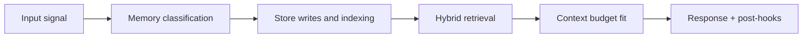

# Re-embed and Backfill Operations

## 1. When to run

- embedding model upgrade
- chunking strategy change
- payload schema evolution requiring re-index
- recovery from historical pipeline defects

## 2. Re-embed workflow

1. define source scope (collections, date range, users)
2. snapshot index metadata
3. run embedding generation with target model
4. dual-write to shadow collection/index
5. compare retrieval quality and latency
6. cut over reads to new collection
7. retire old collection after validation window

## 3. Backfill workflow (transcript -> memories)

1. select sessions not fully consolidated
2. run extraction/scoring pipeline in batch
3. write vectors/index rows idempotently
4. run graphify on accepted items
5. mark batch checkpoint and completion

## 4. Idempotency requirements

- deterministic memory IDs from source keys where possible
- replay-safe upserts for index rows
- graph writes via merge semantics

## 5. Validation checklist

- source item count vs target item count delta
- retrieval quality benchmark comparison
- graph edge/node growth reasonability
- no unresolved terminal job failures

## 6. Rollback strategy

- keep prior vector collection until cutover confidence is achieved
- maintain read-switch flag for instant rollback
- preserve migration manifests and checkpoints

<!-- memory-expansion-2026-04-10 -->

## Builder Addendum: Expanded Control Surface

This addendum extends the document with practical implementation controls for the Tony memory runtime.

| Control surface | Default posture | Why it matters |
|---|---|---|
| Candidate precision | threshold-gated writes | reduces low-signal memory pollution |
| Recall diversity | vector + graph blending | improves answer richness and grounding |
| Durability | multi-store receipts + audit trail | prevents silent memory loss |
| Cost efficiency | token-budget fitting and pruning | preserves quality under context limits |

