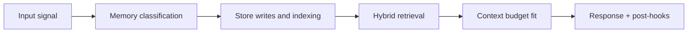

# Consolidation Pipeline

## Purpose

Convert session transcript history into durable memory artifacts.

## Fast lane

Trigger: session idle/close.

1. load transcript
2. summarize
3. extract candidates
4. score and threshold
5. write accepted memories
6. queue graphify payloads

## Deep lane

Trigger: scheduled nightly process.

1. select aged sessions
2. deterministic chunking
3. embedding and vector write
4. archive raw transcript
5. version stamp and completion event

## Quality controls

- acceptance ratio monitoring
- extraction drift checks
- per-content-type distribution checks

## Failure and replay

- retry transient extraction/embed/write failures
- preserve replay manifests for terminal failures
- ensure replay uses idempotent identifiers

<!-- memory-expansion-2026-04-10 -->

## Builder Addendum: Expanded Control Surface

This addendum extends the document with practical implementation controls for the Tony memory runtime.

| Control surface | Default posture | Why it matters |
|---|---|---|
| Candidate precision | threshold-gated writes | reduces low-signal memory pollution |
| Recall diversity | vector + graph blending | improves answer richness and grounding |
| Durability | multi-store receipts + audit trail | prevents silent memory loss |
| Cost efficiency | token-budget fitting and pruning | preserves quality under context limits |

