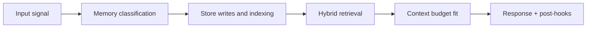

# Graphify Pipeline

## Purpose

Build and maintain relational memory from accepted memory chunks.

## Stages

1. receive accepted memory payload
2. run structured extraction for nodes/edges/confidence
3. canonicalize node keys and relationship keys
4. execute Neo4j merge transaction
5. emit graph update event with counts and confidence stats

## Transaction contract

- batch size is bounded to reduce lock contention
- node and relationship merges are deterministic
- `ON CREATE` and `ON MATCH` metadata updates are explicit

## Data quality controls

- reject unknown label/type combinations
- reject missing direction/type edges
- clamp confidence to valid range
- preserve source_memory_id for each edge

## Replay behavior

Graphify can be replayed from memory index rows using deterministic merge keys without duplicate graph growth.

<!-- memory-expansion-2026-04-10 -->

## Builder Addendum: Expanded Control Surface

This addendum extends the document with practical implementation controls for the Tony memory runtime.

| Control surface | Default posture | Why it matters |
|---|---|---|
| Candidate precision | threshold-gated writes | reduces low-signal memory pollution |
| Recall diversity | vector + graph blending | improves answer richness and grounding |
| Durability | multi-store receipts + audit trail | prevents silent memory loss |
| Cost efficiency | token-budget fitting and pruning | preserves quality under context limits |

