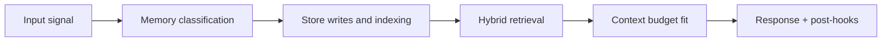

# Ingestion Pipeline

## Purpose

Move live messages into session memory with minimal latency and full traceability.

## Stages

1. **Ingress**
   - receive message with user/session metadata
2. **Validation**
   - schema and policy checks
3. **Hot write**
   - append to Redis session list
4. **Warm write**
   - persist transcript row in PostgreSQL
5. **Context fetch trigger**
   - initiate retrieval pipeline for response assembly

## Idempotency keys

- message-level idempotency key
- session + message hash fallback key

## Failure modes

| Failure | Handling |
|---|---|
| Redis write failure | retry then fallback to warm-only mode |
| PostgreSQL write failure | fail request write stage with explicit error |
| Duplicate message | reject or no-op based on idempotency key |

<!-- memory-expansion-2026-04-10 -->

## Builder Addendum: Expanded Control Surface

This addendum extends the document with practical implementation controls for the Tony memory runtime.

| Control surface | Default posture | Why it matters |
|---|---|---|
| Candidate precision | threshold-gated writes | reduces low-signal memory pollution |
| Recall diversity | vector + graph blending | improves answer richness and grounding |
| Durability | multi-store receipts + audit trail | prevents silent memory loss |
| Cost efficiency | token-budget fitting and pruning | preserves quality under context limits |

