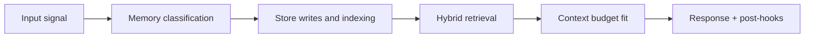

# Retrieval Pipeline

## Purpose

Return the best possible memory context for a request by combining vector similarity and graph structure.

## Stages

1. **Query build**
   - compose query text from message + entities + intent
2. **Parallel retrieval**
   - vector path (Qdrant)
   - graph path (Neo4j)
3. **Rerank**
   - compute retrieval score components
4. **Merge**
   - dedupe and unify rankings
5. **Token fit**
   - trim to memory layer budget
6. **ContextBundle emit**
   - return memory layer to response pipeline

## Scoring contract

```text
retrieval_score =
  (0.5 * semantic_similarity) +
  (0.2 * exp(-0.05 * days_since_creation)) +
  (0.2 * importance_score) +
  (0.1 * normalized_access_count)
```

## Degraded behavior

- one-path failure -> continue with surviving path + degrade marker
- two-path failure -> explicit retrieval failure status

## Telemetry

- stage latency breakdown
- per-path candidate volume
- merge dedupe ratio
- token utilization

<!-- memory-expansion-2026-04-10 -->

## Builder Addendum: Expanded Control Surface

This addendum extends the document with practical implementation controls for the Tony memory runtime.

| Control surface | Default posture | Why it matters |
|---|---|---|
| Candidate precision | threshold-gated writes | reduces low-signal memory pollution |
| Recall diversity | vector + graph blending | improves answer richness and grounding |
| Durability | multi-store receipts + audit trail | prevents silent memory loss |
| Cost efficiency | token-budget fitting and pruning | preserves quality under context limits |


