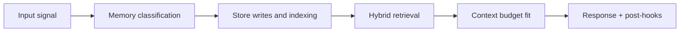

# Memory Types - Seven-System Model

## Index

1. [Type Index](#type-index)
2. [Deep Dives](#deep-dives)
3. [Architecture References](#architecture-references)
4. [Builder Addendum: Expanded Control Surface](#builder-addendum-expanded-control-surface)

## Type Index

| Type | Core function | Primary backend(s) | Typical lifetime |
|---|---|---|---|
| Working | In-flight cognition during one response | LLM context window | Seconds |
| Session | Active conversation continuity | Redis + PostgreSQL | Session to warm retention window |
| Episodic | Historical events and timelines | Qdrant + ClickHouse + MinIO | Long-term |
| Semantic | Stable facts, preferences, decisions | Qdrant (+ PostgreSQL metadata) | Long-term |
| Relational | Entity and dependency graph | Neo4j via Graphify | Long-term |
| Procedural | Personalized behavior rules | PostgreSQL + Redis + ClickHouse + filesystem | Persistent |
| Prospective | Future commitments and follow-ups | PostgreSQL + Redis queue + n8n (+ Qdrant context) | Until resolved |

## Deep Dives

1. [Working memory](working/README.md)
2. [Session memory](session/README.md)
3. [Episodic memory](episodic/README.md)
4. [Semantic memory](semantic/README.md)
5. [Relational memory](relational/README.md)
6. [Procedural memory](procedural/README.md)
7. [Prospective memory](prospective/README.md)

## Architecture References

- `../memory_taxonomy.svg`
- `../memory_lifecycle.svg`
- `../graphify_dual_retrieval.svg`

<!-- memory-expansion-2026-04-10 -->

## Builder Addendum: Expanded Control Surface

This addendum extends the document with practical implementation controls for the Tony memory runtime.

| Control surface | Default posture | Why it matters |
|---|---|---|
| Candidate precision | threshold-gated writes | reduces low-signal memory pollution |
| Recall diversity | vector + graph blending | improves answer richness and grounding |
| Durability | multi-store receipts + audit trail | prevents silent memory loss |
| Cost efficiency | token-budget fitting and pruning | preserves quality under context limits |

