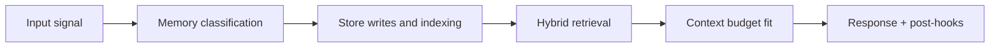

# Procedural Memory

## Index

1. [Purpose](#purpose)
2. [Primary Sources](#primary-sources)
3. [Runtime Use](#runtime-use)
4. [What It Enables](#what-it-enables)
5. [Failure Mode It Prevents](#failure-mode-it-prevents)
6. [Builder Addendum: Expanded Control Surface](#builder-addendum-expanded-control-surface)

## Purpose

Procedural memory defines how Tony should behave for this specific user. It shapes output style, priorities, and decision policies even when not explicitly retrieved as conversation content.

## Primary Sources

| Source | Backend |
|---|---|
| Identity config (voice, preferences, goals) | PostgreSQL, cached to Redis |
| Learned behavior patterns (habits, rhythms) | ClickHouse analytics |
| Agent-specific system prompts and playbooks | Files on disk |

## Runtime Use

Procedural memory is loaded into orchestration policy and prompt setup before response generation, rather than treated as ad-hoc semantic recall.

## What It Enables

- Stable personalization across sessions
- Consistent response behavior across agents
- Adaptive behavior based on observed usage patterns

## Failure Mode It Prevents

Without procedural memory, Tony behaves inconsistently and loses user-specific operating style between sessions.

<!-- memory-expansion-2026-04-10 -->

## Builder Addendum: Expanded Control Surface

This addendum extends the document with practical implementation controls for the Tony memory runtime.

| Control surface | Default posture | Why it matters |
|---|---|---|
| Candidate precision | threshold-gated writes | reduces low-signal memory pollution |
| Recall diversity | vector + graph blending | improves answer richness and grounding |
| Durability | multi-store receipts + audit trail | prevents silent memory loss |
| Cost efficiency | token-budget fitting and pruning | preserves quality under context limits |

