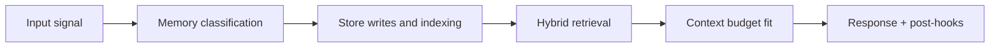

# Prospective Memory

## Index

1. [Purpose](#purpose)
2. [Primary Stores](#primary-stores)
3. [Lifecycle](#lifecycle)
4. [What It Enables](#what-it-enables)
5. [Failure Mode It Prevents](#failure-mode-it-prevents)
6. [Builder Addendum: Expanded Control Surface](#builder-addendum-expanded-control-surface)

## Purpose

Prospective memory tracks what Tony must do in the future: reminders, follow-ups, and commitments extracted from conversation.

## Primary Stores

| Artifact | Backend | Role |
|---|---|---|
| Reminder/follow-up records | PostgreSQL | Durable pending work |
| Dispatch queue | Redis queue | Near-term trigger execution |
| Proactive trigger workflows | n8n | Cron/calendar-driven activation |
| High-importance commitment context | Qdrant | Semantic recall for commitments (often high importance) |

## Lifecycle

1. Commitments are extracted during memory consolidation.
2. Items are normalized into reminder/follow-up records with schedule metadata.
3. Scheduler scans due items and dispatches trigger jobs.
4. Completion state and outcomes are logged for future recall.

## What It Enables

- Reliable follow-through on promises made in prior conversations
- Proactive reminders without re-asking the user
- Context-aware follow-up generation tied to past commitments

## Failure Mode It Prevents

Without prospective memory, commitments decay into passive history and Tony forgets to act.

<!-- memory-expansion-2026-04-10 -->

## Builder Addendum: Expanded Control Surface

This addendum extends the document with practical implementation controls for the Tony memory runtime.

| Control surface | Default posture | Why it matters |
|---|---|---|
| Candidate precision | threshold-gated writes | reduces low-signal memory pollution |
| Recall diversity | vector + graph blending | improves answer richness and grounding |
| Durability | multi-store receipts + audit trail | prevents silent memory loss |
| Cost efficiency | token-budget fitting and pruning | preserves quality under context limits |

