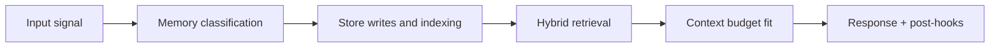

# Working Memory

## Index

1. [Purpose](#purpose)
2. [What Lives Here](#what-lives-here)
3. [Storage and Lifetime](#storage-and-lifetime)
4. [Runtime Contract](#runtime-contract)
5. [Failure Mode It Prevents](#failure-mode-it-prevents)
6. [Builder Addendum: Expanded Control Surface](#builder-addendum-expanded-control-surface)

## Purpose

Working memory is Tony's in-flight state for a single response cycle. It exists only while the model is reasoning and generating an answer.

## What Lives Here

- Current prompt + partial response state
- ReAct loop tool call observations
- Temporary execution-plan state from orchestration

## Storage and Lifetime

| Backend | Data | Lifetime |
|---|---|---|
| LLM context window | Prompt, tool outputs, reasoning scratch state | Destroyed when response is synthesized |

## Runtime Contract

1. `ContextAssembler` builds the prompt from hot session data plus retrieved memory.
2. Agents/tools iterate, appending temporary observations.
3. Final synthesis completes and the working set is discarded.

## Failure Mode It Prevents

Without strict working-memory boundaries, temporary tool state can leak into durable memory or pollute future turns.

<!-- memory-expansion-2026-04-10 -->

## Builder Addendum: Expanded Control Surface

This addendum extends the document with practical implementation controls for the Tony memory runtime.

| Control surface | Default posture | Why it matters |
|---|---|---|
| Candidate precision | threshold-gated writes | reduces low-signal memory pollution |
| Recall diversity | vector + graph blending | improves answer richness and grounding |
| Durability | multi-store receipts + audit trail | prevents silent memory loss |
| Cost efficiency | token-budget fitting and pruning | preserves quality under context limits |

