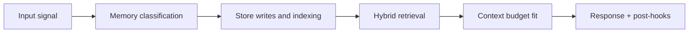

# Memory Workflows

## Index

1. [Documents](#documents)
2. [Why this folder exists](#why-this-folder-exists)
3. [Builder Addendum: Expanded Control Surface](#builder-addendum-expanded-control-surface)

## Documents

| File | Scope |
|---|---|
| `message-to-memory.md` | live message from ingestion to retrievable long-term memory |
| `forget-and-redaction.md` | user forget requests and cross-store propagation |
| `proactive-followup.md` | commitment extraction, scheduling, and proactive execution |

## Why this folder exists

Architecture defines components.  
Contracts define data.  
Workflow docs define real operational behavior across both.

<!-- memory-expansion-2026-04-10 -->

## Builder Addendum: Expanded Control Surface

This addendum extends the document with practical implementation controls for the Tony memory runtime.

| Control surface | Default posture | Why it matters |
|---|---|---|
| Candidate precision | threshold-gated writes | reduces low-signal memory pollution |
| Recall diversity | vector + graph blending | improves answer richness and grounding |
| Durability | multi-store receipts + audit trail | prevents silent memory loss |
| Cost efficiency | token-budget fitting and pruning | preserves quality under context limits |

