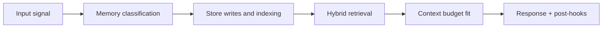

# Workflow: Forget and Redaction

## Scenario

User asks Tony to forget a specific fact or remove sensitive memory.

## Flow

1. Request is authenticated and authorized.
2. Target memory scope is resolved (by ID, query, or category).
3. Canonical index rows are marked for deletion/redaction.
4. Qdrant points are removed/redacted.
5. Neo4j relationships and derived nodes are removed/redacted where required.
6. Archive tombstone/redaction manifest is appended.
7. Completion event is written to audit log.

## Completion criteria

Operation is complete only when all required stores acknowledge completion.

## Failure policy

- partial completion is marked incomplete, never silent success
- failed store operations are retried with explicit reason tracking
- unresolved failures trigger operational alerting

## Audit record requirements

- requestor identity
- target scope
- action taken per store
- timestamps and status
- terminal reason (if failed)

<!-- memory-expansion-2026-04-10 -->

## Builder Addendum: Expanded Control Surface

This addendum extends the document with practical implementation controls for the Tony memory runtime.

| Control surface | Default posture | Why it matters |
|---|---|---|
| Candidate precision | threshold-gated writes | reduces low-signal memory pollution |
| Recall diversity | vector + graph blending | improves answer richness and grounding |
| Durability | multi-store receipts + audit trail | prevents silent memory loss |
| Cost efficiency | token-budget fitting and pruning | preserves quality under context limits |

