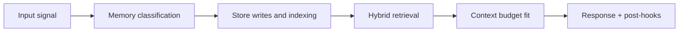

# Workflow: Message to Memory

## Scenario

User says: "Let's use PostgreSQL for Atlas and remind me Friday to check migration progress."

## End-to-end flow

1. API receives message with `session_id`.
2. Message is written to hot session list (Redis).
3. ContextAssembler fetches hot tail + prior memory layer.
4. Agent response is synthesized (working memory phase).
5. On idle/close, fast consolidation runs:
   - extract decision memory ("use PostgreSQL for Atlas")
   - extract commitment memory ("remind Friday")
6. Decision memory path:
   - vector write to Qdrant
   - index write to PostgreSQL
   - Graphify extracts nodes/edges and merges in Neo4j
7. Commitment memory path:
   - reminder record created in PostgreSQL
   - scheduler trigger metadata created for n8n
8. Memory is now retrievable by:
   - semantic similarity (Qdrant)
   - relationship traversal (Neo4j)
   - due schedule checks (prospective path)

## Outcome guarantees

- the decision is durable semantic memory
- Atlas relationship graph is reinforced
- follow-up becomes actionable prospective memory

<!-- memory-expansion-2026-04-10 -->

## Builder Addendum: Expanded Control Surface

This addendum extends the document with practical implementation controls for the Tony memory runtime.

| Control surface | Default posture | Why it matters |
|---|---|---|
| Candidate precision | threshold-gated writes | reduces low-signal memory pollution |
| Recall diversity | vector + graph blending | improves answer richness and grounding |
| Durability | multi-store receipts + audit trail | prevents silent memory loss |
| Cost efficiency | token-budget fitting and pruning | preserves quality under context limits |

