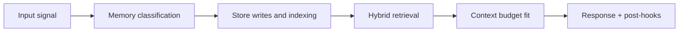

# Workflow: Proactive Follow-up

## Scenario

Tony proactively follows up on a commitment extracted from earlier conversation.

## Flow

1. Consolidation extracts commitment/reminder candidate.
2. Candidate is normalized into prospective record (`scheduled` state).
3. Package scheduler integration evaluates due window and policy constraints.
4. At due time, workflow dispatches follow-up action.
5. Outcome is recorded:
   - `completed`
   - `retry_scheduled`
   - `failed`
   - `expired`

## Policy gates

- quiet-hour and channel constraints
- dedupe by reminder key
- privacy-level constraints for proactive content

## Reliability behavior

- at-least-once scheduling
- idempotent dispatch handlers
- bounded retries with explicit terminal reasons

## Traceability

Each proactive action links back to:

- source memory ID
- reminder ID
- dispatch attempt history

<!-- memory-expansion-2026-04-10 -->

## Builder Addendum: Expanded Control Surface

This addendum extends the document with practical implementation controls for the Tony memory runtime.

| Control surface | Default posture | Why it matters |
|---|---|---|
| Candidate precision | threshold-gated writes | reduces low-signal memory pollution |
| Recall diversity | vector + graph blending | improves answer richness and grounding |
| Durability | multi-store receipts + audit trail | prevents silent memory loss |
| Cost efficiency | token-budget fitting and pruning | preserves quality under context limits |

